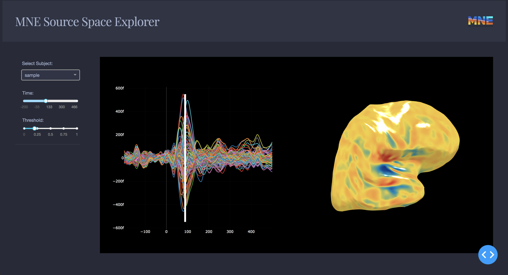

# MNE Source Space Explorer




## Getting Started
### Using the demo
This demo lets you interactive with your source space data.
### Running the app locally

First create a virtual environment with conda or venv inside a temp folder, then activate it.

```
virtualenv mne-dash-venv

# Windows
mne-dash-venv\Scripts\activate
# Or Linux
source venv/bin/activate
```

Clone the git repo, then install the requirements with pip
```
git clone https://github.com/mne-tools/mne-dash.git
cd mne-dash
pip install -r requirements.txt
```

Run the app
```
python app.py
```

## About the app
### How does it work?

This app is fully written in Dash + mne-python. 

## Built With
* [Dash](https://dash.plot.ly/) - Main server and interactive components
* [Plotly Python](https://plot.ly/python/) - Used to create the interactive plots

## Authors

* **Sheraz Khan** - *Initial Work* - [@SherazKhan](https://github.com/SherazKhan)


